# Informe de Avance - Proyecto Final (COM610)

- **Universidad:** Universidad San Francisco Xavier de Chuquisaca
- **Asignatura:** Trabajando en la Nube (COM610)
- **Docente:** Ing. Marcelo Quispe Ortega
- **Estudiantes:** Javier Diego Minto Arze
- **Proyecto:** Sistema de Gestión y Calificaciones - Colegio Boliviano Alemán
- **Repositorio GitHub:** https://github.com/DIegoMinto/colegio-aleman-system.git

---

## 1. Tabla de Infraestructura y Servicios

| Componente / Servicio               | Tecnología                    | Rol / Función                                                                                                                                                 | IP / Puerto / Endpoint                                     | Estado        |
| :---------------------------------- | :---------------------------- | :------------------------------------------------------------------------------------------------------------------------------------------------------------ | :--------------------------------------------------------- | :------------ |
| **Servidor de Cómputo**             | AWS EC2 (Ubuntu)              | Host principal de la infraestructura y contenedores enlazada al repositorio mediante claves secretas                                                          | `3.39.233.229`                                             | **Operativo** |
| **Servidor Web / Proxy**            | Nginx (Alpine)                | Proxy inverso, manejo de peticiones HTTP y estáticos                                                                                                          | Puerto `8000:80`                                           | **Operativo** |
| **Backend de la App**               | Laravel 13 (PHP 8.3 FPM)      | Lógica de funcionamiento del sistema de calificaciones con el CRUD de profesores                                                                              | Puerto `9000` (interno)                                    | **Operativo** |
| **Caché y Sesiones**                | Redis (Alpine)                | Optimización de consultas y manejo de sesiones de usuario                                                                                                     | Puerto `6379` (interno)                                    | **Operativo** |
| **Base de Datos (Dev)**             | PostgreSQL 15                 | Persistencia local de datos para desarrollo en contenedor de docker                                                                                           | Puerto `5432:5432`                                         | **Operativo** |
| **Base de Datos (Prod)**            | AWS RDS (PostgreSQL)          | Persistencia administrada y escalable en la nube mediante el servicio de RDS con un motor de PostgreSQL                                                       | `colegio-db.cxigwmcgi2me.ap-northeast-2.rds.amazonaws.com` | **Operativo** |
| **CI/CD Pipeline**                  | GitHub Actions                | Automatización de despliegue continuo con el fin de asegurar buenas prácticas en el desarrollo antes de publicar avances en la rama principal del repositorio | Evento `push` a `main`                                     | **Operativo** |
| **Gestión de Accesos**              | AWS IAM                       | Credenciales restringidas para el flujo de despliegue con acceso a la instancia EC2 en GitHub Actions                                                         | AWS Access Keys                                            | **Operativo** |
| **Balanceador de Carga**            | AWS Application Load Balancer | Distribuye las peticiones HTTP/HTTPS entrantes equitativamente entre las instancias EC2 del grupo de destino, con comprobaciones de salud automáticas         | `aleman-alb-680453520.ap-northeast-2.elb.amazonaws.com`    | **Operativo** |
| **Escalado Automático**             | AWS Auto Scaling Group        | Crea o destruye instancias EC2 automáticamente según la utilización de CPU (umbral 70%), manteniendo entre 1 y 2 instancias activas                           | Grupo `asg-laravel-colegio`                                | **Operativo** |
| **Resolución de Dominio**           | DuckDNS                       | Provee un dominio dinámico público que resuelve hacia el endpoint del Load Balancer, evitando depender de IPs cambiantes                                      | `colegioaleman-usfx.duckdns.org`                           | **Operativo** |
| **Almacenamiento de Archivos**      | AWS S3                        | Almacenamiento centralizado de imágenes y PDFs adjuntos a las noticias escolares, independiente de las instancias EC2                                         | Bucket `colegio-aleman-bucket-aws`                         | **Operativo** |
| **CDN / Distribución de Contenido** | AWS CloudFront                | Distribuye en caché los archivos del bucket S3 desde el punto de presencia más cercano al usuario, reduciendo latencia y exposición pública del origen        | `d3cihcc5kg0b74.cloudfront.net`                            | **Operativo** |

---

## 2. Bitácora de Avance

| Fecha      | Actividad                                                                                                                                 | Responsable             | Dificultad Superada                                                                                                                                                                                                                    |
| :--------- | :---------------------------------------------------------------------------------------------------------------------------------------- | :---------------------- | :------------------------------------------------------------------------------------------------------------------------------------------------------------------------------------------------------------------------------------- |
| 25/05/2026 | **Dockerización completa y red de contenedores:** Creación del entorno multi-contenedor para aislar la aplicación de notas.               | Javier Diego Minto Arze | —                                                                                                                                                                                                                                      |
| 26/05/2026 | **Configuración del servidor web en la nube (AWS EC2):** Aprovisionamiento de la instancia Ubuntu y despliegue del proyecto.              | Javier Diego Minto Arze | El servidor levantaba pero no respondía externamente desde el navegador; la URL correcta es la IP pública sumada al puerto de Nginx.                                                                                                   |
| 26/05/2026 | **Desacoplamiento de datos (Amazon RDS con PostgreSQL):** Creación de la base de datos externa administrada.                              | Javier Diego Minto Arze | Para probar la conexión e inyectar las tablas del colegio, se configuró temporalmente el acceso global (`0.0.0.0/0`) en el Security Group de RDS, permitiendo enlazar pgAdmin 4 desde el equipo local.                                 |
| 26/05/2026 | **Automatización de flujos de deploy y control de accesos (CI/CD + IAM):** Configuración de GitHub Actions.                               | Javier Diego Minto Arze | Para no exponer contraseñas ni el archivo `.env` en el repositorio público, se guardaron las credenciales en GitHub Secrets; se creó también un usuario en AWS IAM con permisos FullAccess para futuras implementaciones de seguridad. |
| 14/06/2026 | **Alta disponibilidad y escalado automático (ALB + Auto Scaling):** Configuración del Application Load Balancer y del Auto Scaling Group. | Javier Diego Minto Arze | Al depender de instancias dinámicas con IP cambiante, se necesitó generar una AMI base con Docker y Laravel ya configurados para que cada instancia nueva del Auto Scaling se levante lista, sin reconfiguración manual.               |
| 15/06/2026 | **Enrutamiento de dominio dinámico (DuckDNS):** Configuración del dominio público apuntando al Load Balancer.                             | Javier Diego Minto Arze | DuckDNS no permite registros tipo CNAME hacia el endpoint del ALB en su plan gratuito, por lo que se optó temporalmente por apuntar el dominio a la IP pública de la instancia principal.                                              |
| 15/06/2026 | **Almacenamiento de archivos en la nube (Amazon S3):** Integración del bucket S3 para imágenes y PDFs de noticias escolares.              | Javier Diego Minto Arze | La subida de archivos fallaba devolviendo `false` sin lanzar excepción visible; depurando con el SDK de AWS directamente se identificó que el usuario IAM del pipeline no tenía el permiso `s3:PutObject` sobre el bucket.             |
| 15/06/2026 | **Distribución de contenido mediante CDN (Amazon CloudFront):** Creación de la distribución sobre el bucket S3 para reducir latencia.     | Javier Diego Minto Arze | Tras crear la distribución, las imágenes no cargaban hasta actualizar la política de bucket de S3 autorizando explícitamente al `Service Principal` de CloudFront mediante la condición `AWS:SourceArn`.                               |

## 3. Diagrama de Arquitectura

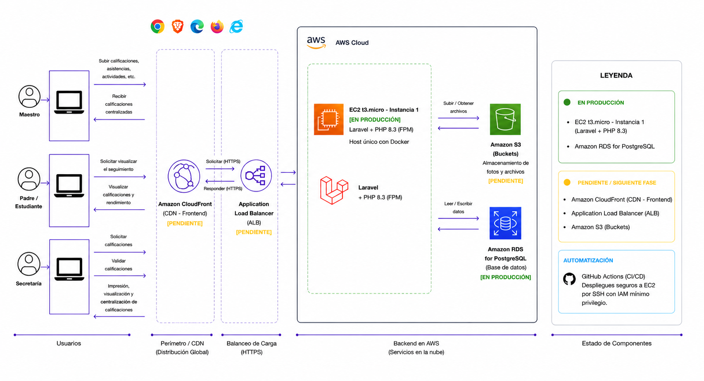

## 4. Comandos Principales Utilizados y Servicios de AWS

### Sección 1: Contenedores y Orquestación (Docker & Compose)

Para esto vamos a usar en nuestro equipo local nuestro proyecto de Laravel el cual tiene un Dockerfile:

```
FROM php:8.3-fpm

RUN apt-get update && apt-get install -y \
    libpq-dev \
    libzip-dev \
    zip \
    unzip \
    git \
    curl \
    build-essential \
    autoconf \
    pkg-config \
    libssl-dev \
    && rm -rf /var/lib/apt/lists/*

RUN docker-php-ext-install pdo pdo_pgsql zip opcache

RUN pecl update-channels \
    && pecl install redis \
    && docker-php-ext-enable redis

RUN apt-get update && apt-get install -y \
    nodejs \
    npm

COPY docker-config/php/opcache.ini /usr/local/etc/php/conf.d/opcache.ini

COPY --from=composer:latest /usr/bin/composer /usr/bin/composer

WORKDIR /var/www

COPY . .

RUN mkdir -p storage bootstrap/cache \
    && chown -R www-data:www-data storage bootstrap/cache

EXPOSE 9000

CMD ["php-fpm"]

```

Y el docker-compose.yml

```
version: "3.8"

services:
    app:
        build: .
        container_name: colegio-app
        restart: unless-stopped
        volumes:
            - ./:/var/www
            - vendor:/var/www/vendor
        networks:
            - colegio-net
        depends_on:
            - db
            - redis
        ports:
            - "5173:5173"

    nginx:
        image: nginx:alpine
        container_name: colegio-nginx
        restart: unless-stopped
        ports:
            - "8000:80"
        volumes:
            - ./:/var/www
            - ./docker-config/nginx:/etc/nginx/conf.d
        networks:
            - colegio-net

    db:
        image: postgres:15-alpine
        container_name: colegio-db
        restart: always
        environment:
            POSTGRES_USER: colegio_aleman_1957
            POSTGRES_PASSWORD: 11021957cA
            POSTGRES_DB: colegio_db
        ports:
            - "5432:5432"
        volumes:
            - colegio_pg_data:/var/lib/postgresql/data
        networks:
            - colegio-net

    redis:
        image: redis:alpine
        container_name: colegio-redis
        restart: always
        networks:
            - colegio-net

networks:
    colegio-net:
        driver: bridge

volumes:
    colegio_pg_data:
    vendor:

```

Para construir nuestros contenedores usamos el siguiente comando:

```bash
docker compose up -d --build
```

Ahora verificamos el estado de los servicios y mapeo de puertos en tiempo real

```bash
docker compose ps
```

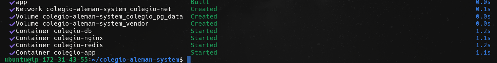

### Sección 2: Conectividad y Redes

Verificamos la existencia y el correcto aprovisionamiento de la red interna del colegio con el siguiente comando:

```bash
docker network ls
```

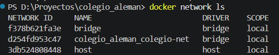

Con esto ya tenemos nuestro entorno de Docker funcional con su debida persistencia de datos.

### Sección 3: Infraestructura en AWS

Para empezar dentro de AWS, nos vamos al servicio de EC2 y creamos una nueva instancia, a esta la denominaremos `colegio-aleman-server`, y será una instancia con t3.micro con Ubuntu, dicha instancia fue asignada con la ip pública: 3.39.233.229, cabe aclarar que durante la creación crearemos una llave criptográfica `.pem` la cual estará almacenada en nuestro equipo, despues de todo este proceso tenemos la siguiente instancia:

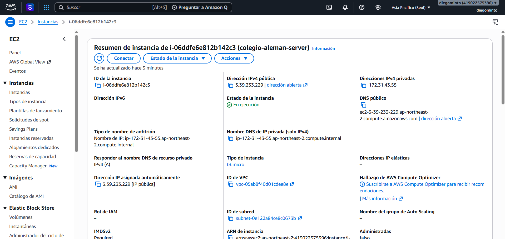

La instancia cuenta con las siguientes reglas de entrada:

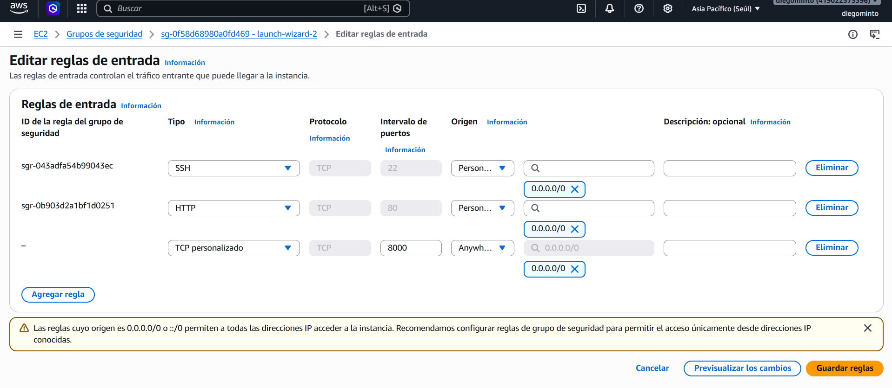

Donde:

- La primera regla TCP SSH es la que permite conectarnos de forma remota y segura mediante un terminal externo utilizando la llave privada (colegio-aleman-key.pem).
- La segunda regla TCP HTTP abre un puerto estándar, en este caso el 80, para la navegación web sin encriptar, está preparado para recibir las peticiones comunes de los navegadores cuando alguien intente ingresar al sistema de calificaciones a través de la web.
- La tecera regla, es crucial dado que el contenedor de Nginx está configurado con el puerto 8000:80, por lo tanto necesitamos que AWS deje pasar el tráfico externo por el puerto 8000 para que cuando pongamos la IP pública en el navegador seguida de :8000 (http://3.39.233.229:8000), la petición logre entrar a la EC2 y llegar directo a al contenedor de Nginx de Docker.

Ahora desde Warp, ingresamos a la instancia con el siguiente comando:

```bash
ssh -i "C:\Users\diego\OneDrive\Desktop\colegio-aleman-key.pem" ubuntu@3.39.233.229
```

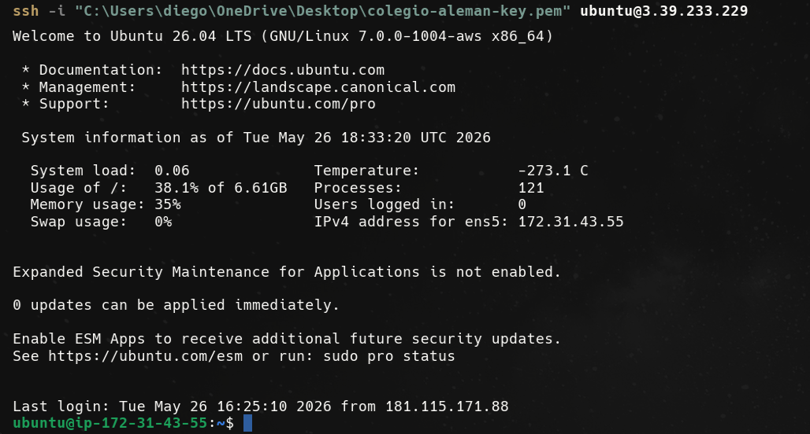

Una vez dentro de la instancia procedemos a configurar el entorno, para ello antes actualizamos los repositorios de paquetes con el fin de tener disponible las últimas versiones de los paquetes que se van a instalar.

```bash
sudo apt update
sudo apt upgrade
```

### Sección 3.1. Configuración de Docker en EC2

Ahora que tenemos todos los paquetes actualizados, descargamos el demonio de Docker y realizamos la configuración para que se inicie automáticamente cada vez que el servidor EC2 se reinicie y lo arranca de forma inmediata.

```bash
sudo apt install docker.io -y
sudo systemctl enable docker
sudo systemctl start docker
```

Una vez hecho esto procedemos a verificar la instalación y configuración.

```bash
docker --version
```

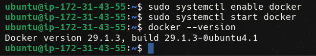

### Sección 3.2. Configuración de Laravel en EC2

Instalamos las dependencias de PHP, para ello ejecutamos Composer de forma aislada dentro del contenedor del backend para descargar e instalar de forma segura todas las librerías del framework definidas en el composer.json.

```bash
sudo docker compose exec app composer install
```

Generamos la clave de cifrado de la aplicación, este es un comando mandatorio de Laravel que genera la llave APP_KEY en el archivo .env de producción para garantizar el cifrado seguro de cookies, sesiones y contraseñas de los usuarios.

```bash
sudo docker compose exec app php artisan key:generate
```

Ejecutamos las migraciones de la aplicación en la nube, esto impacta en la base de datos para la construcción del esquema de tablas del sistema de calificaciones del colegio que ya habían sido modeladas con anterioridad.

```bash
sudo docker compose exec app php artisan migrate
```

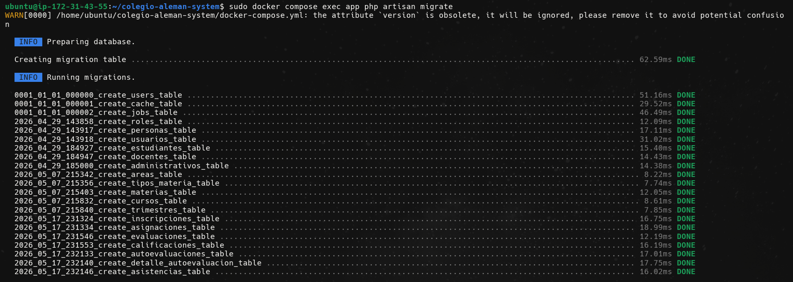

### Sección 3.3. Compilación de Activos Estáticos y Estilos del Frontend

Compilamos los assets con Vite - Node.js, para esto accedemos de forma interactiva a la terminal del contenedor de docker donde instalamos los módulos de Node y ejecutamos el bundler en modo producción con npm run build para minificar y compilar los archivos CSS y JavaScript, este paso es importante para que las vistas del sistema de calificaciones carguen correctamente en el navegador con sus estilos correspondientes.

Entramos al contenedor:

```bash
sudo docker compose exec app bash
```

Y realizamos lo siguiente:

```bash
npm install
npm run build
```

Ahora podemos ver el sitio web ingresando a: http://3.39.233.229:8000/login

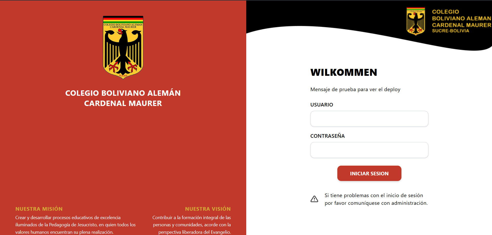

## 5. Configuración de Github Actions

### 5.1. Pipeline de Integración Continua (`ci.yml`)

Este flujo se dispara al hacer un push hacia la rama main del repositorio, construye la arquitectura de manera aislada en los servidores de GitHub para garantizar que ningún cambio de código rompa la aplicación en producción de forma que se tiene una visualización de los errores en cada trabajo del pipeline.

```yaml
name: CI

on:
push:
branches: [main]

pull_request:
branches: [main]

jobs:
laravel-tests:
runs-on: ubuntu-latest

    steps:
      - name: Checkout del codigo
        uses: actions/checkout@v4

      - name: Crear archivo .env
        run: cp .env.example .env

      - name: Construir contenedores
        run: docker compose build

      - name: Levantar contenedores
        run: docker compose up -d

      - name: Ver contenedores activos
        run: docker compose ps

      - name: Esperar base de datos
        run: sleep 15

      - name: Instalar dependencias Composer
        run: docker compose exec -T app composer install

      - name: Generar APP_KEY
        run: docker compose exec -T app php artisan key:generate

      - name: Ejecutar migraciones
        run: docker compose exec -T app php artisan migrate --force

      - name: Limpiar cache Laravel
        run: docker compose exec -T app php artisan optimize:clear

      - name: Verificar Laravel
        run: docker compose exec -T app php artisan about
```

Donde:

- actions/checkout@v4: Descarga una copia del código del repositorio en el entorno virtual de GitHub.

- sleep 15: Pausa en el pipeline para dar tiempo a que el motor de PostgreSQL (colegio-db) inicialice por completo su socket de red interno antes de recibir las migraciones.

- docker compose exec -T: El uso de -T es importante para entornos de automatización, ya que los pipelines no cuentan con una terminal interactiva activa.

- php artisan migrate --force: Ejecuta las migraciones en los entornos virtuales.

Una vez tenemos esto procedemos a subir los cambios al repositorio con los siguientes comandos (Este commit es perteneciente a una corrección donde no agregamos Composer al flujo):

```bash
git add .
git commit -m "Corrección en el ci por Composer"
git push origin main

```

Despues vamos al apartado de actions en Github y vemos que el pipeline fue exitoso:

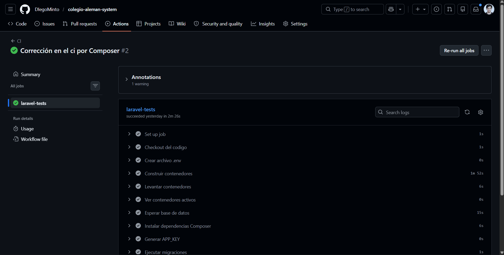

### 5.2. Pipeline de Despliegue Continuo (`deploy.yml`)

Una vez que el código pasa las pruebas de CI y se sube a la rama main, necesitamos que los cambios se vean reflejados en la aplicación en la nube dentro de la instancia de EC2, para ello debemos realizar un despliegue remoto de forma segura utilizando el siguiente código deplo.yml:

```yaml
name: Deploy

on:
push:
branches: - main

jobs:
deploy:
runs-on: ubuntu-latest

    steps:
      - name: Checkout del codigo
        uses: actions/checkout@v4

      - name: Deploy en EC2 por SSH
        uses: appleboy/ssh-action@v1.0.3
        with:
          host: ${{ vars.EC2_HOST }}
          username: ${{ vars.EC2_USER }}
          key: ${{ secrets.SSH_PRIVATE_KEY }}

          script: |
            cd ~/colegio-aleman-system
            git pull origin main
            sudo docker compose down
            sudo docker compose up -d --build
            sudo docker compose exec -T app composer install
            sudo docker compose exec -T app php artisan migrate --force
            sudo docker compose exec -T app php artisan optimize:clear
```

Donde:

- appleboy/ssh-action@v1.0.3: Utiliza un túnel SSH encriptado para ingresar al servidor remoto AWS de manera automática.

Ahora gestionamos las variables de forma segura mediante secretos en el repositorio de Github para que estas no viajen en texto plano por la red, para ello debemos tomar en cuenta las siguientes claves y variables:

- EC2_HOST y EC2_USER: Son variables globales de entorno configuradas en GitHub, donde el host es la ip pública de nuestra instancia y el user es el usuario de la instancia denominado "ubuntu".

- SSH_PRIVATE_KEY: Esta es la clave generada anteriormente en la cración de la instancia de EC2, debemos pegar el contenido de dicha clave aquí.

En Github deberíamos tener lo siguiente:

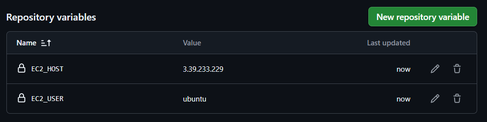

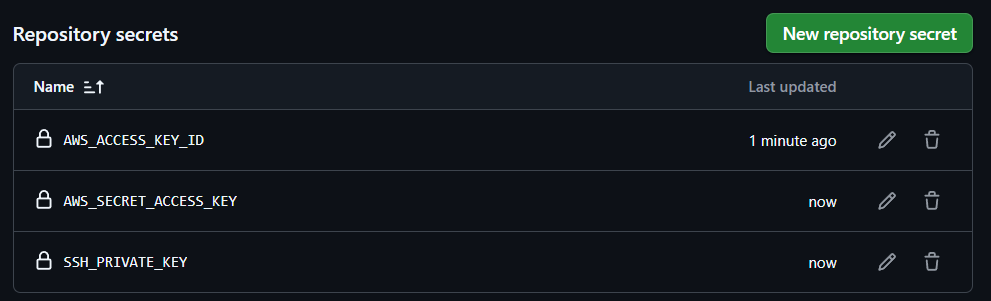

Una vez hecho este flujo podemos ver que el despliegue es totalmente efectivo con las siguientes capturas:

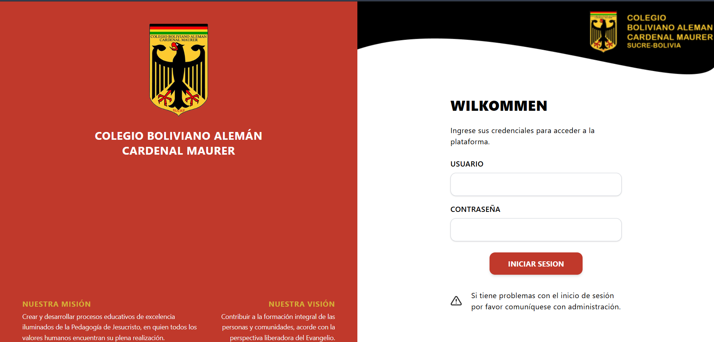

Ahora realizaremos un cambio en el login para ver los resultados del despliegue:

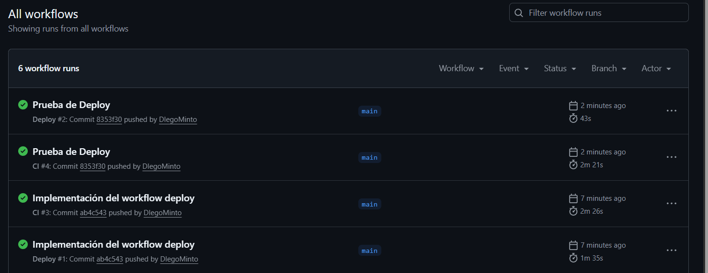

Ya que el pipeline fue exitoso vamos a la aplicación y comprobamos que los cambios:


Paralelamente a la autenticación por llaves SSH, como se ve en la imagen de los secretos de Github, se configuró un usuario en el servicio AWS IAM, este usuario cuenta con claves de acceso específicas (AWS_ACCESS_KEY_ID y AWS_SECRET_ACCESS_KEY) integradas en GitHub.

En las siguientes imágenes vemos el proceso de creación del usuario:

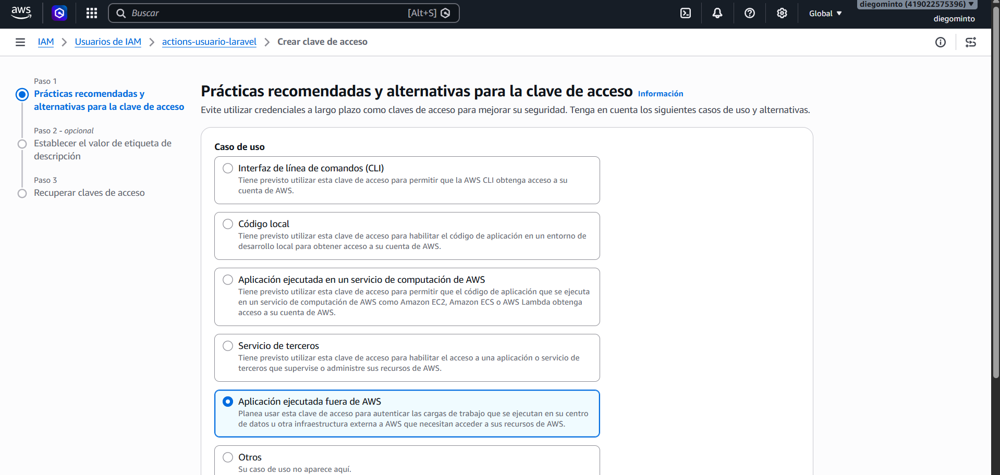

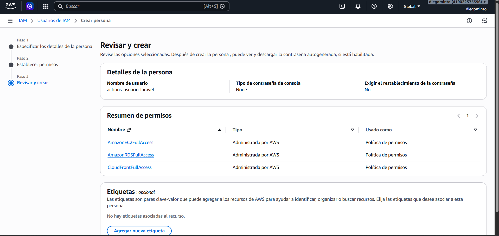

Como se observa a usuario se le asignaron políticas de control de accesos:

- AmazonEC2FullAccess: Habilita el control operativo de las instancias de cómputo que es necesario para supervisar la elasticidad del servidor web en una próxima entrega y los grupos de seguridad de la instancia EC2.

- AmazonRDSFullAccess: Prepara el entorno para la migración del motor de base de datos local hacia una instancia administrada en Amazon RDS aislando la capa de datos de la capa de aplicación.

- AmazonCloudFrontFullAccess: Otorga las capacidades de administración sobre la CDN de AWS CloudFront configurada para almacenar en caché los activos estáticos del frontend generados por Vite, optimizando la latencia de carga para los usuarios finales del colegio tomando en cuenta la gran cantidad de estudiantes que ingresarán en un entorno de producción.

## 6. Integración de Amazon RDS con PostgreSQL

Ahora que se cuenta con un entorno en operación, debemos cambiar la base de datos de la instancia EC2, por una que será manejada en producción, para esto crearemos una base de datos en Amazon RDS con las siguientes características:

- Motor de Base de Datos: PostgreSQL.
  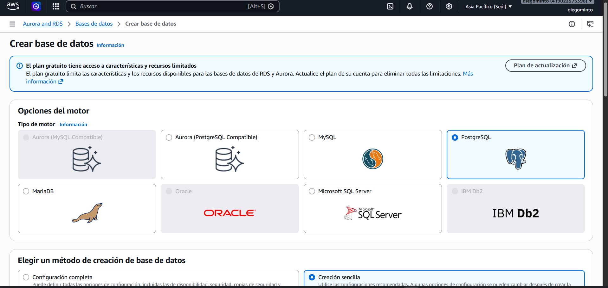
- Clase de Instancia: db.t4g.micro.
- Tipo de Almacenamiento: Purpose SSD (gp3) de 20 GiB.
  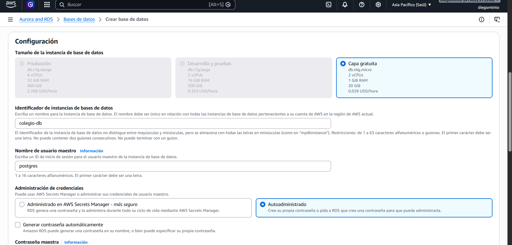
- Punto de Enlace: `colegio-db.cxigwmcgi2me.ap-northeast-2.rds.amazonaws.com`
- Puerto de Comunicación: 5432
  Durante la creación debemos vincularla a la instancia EC2:
  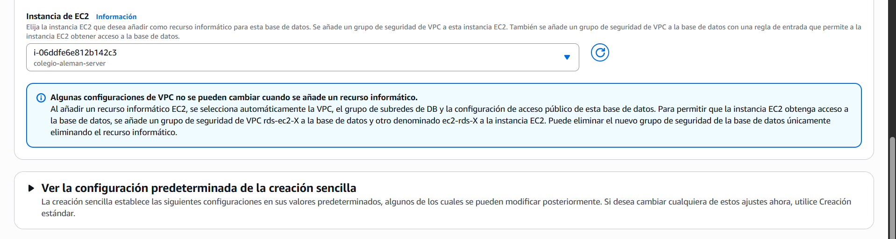

Una vez hecho esto tenemos el siguiente resultado:

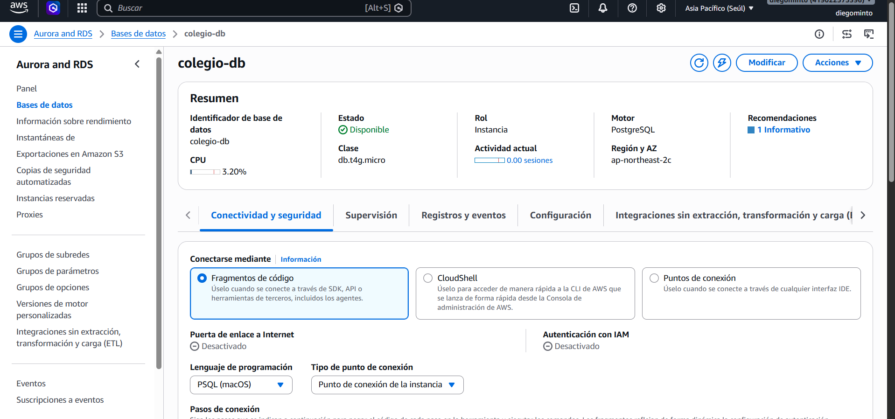

Dentro de los grupos de seguridad de la base de datos debemos configurar una regla de entrada para acceder a la base de datos libremente:

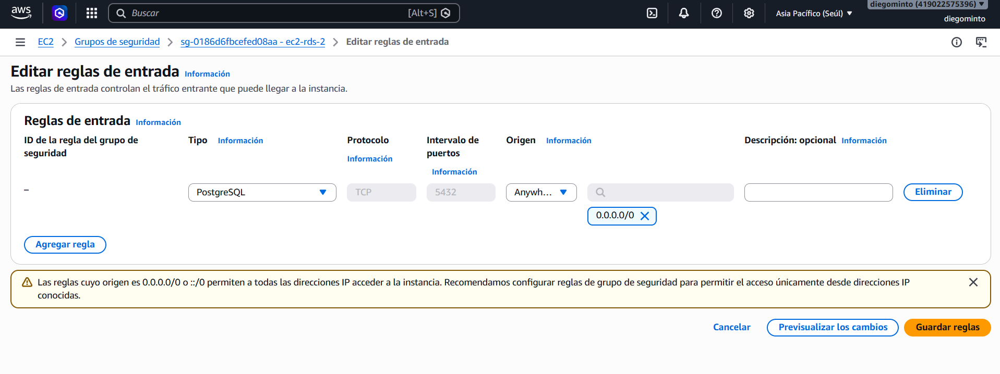

Una vez hecho todo esto debemos probar la conexión, vamos a Warp nuevamente y antes de probar la conexión y hacer las migraciones, debemos configurar el archivo .env con las variables de nuestra base de datos correspondientes, para ello:

```bash
    sudo nano .env
```

Y aquí cambiamos las variables:

- DB_CONNECTION=pgsql
- DB_HOST=colegio-db.cxigwmcgi2me.ap-northeast-2.rds.amazonaws.com
- DB_PORT=(ponemos el puerto)
- DB_DATABASE=(ponemos la base de datos)
- DB_USERNAME=(ponemos el usuario)
- DB_PASSWORD=(ponemos la contraseña)

Ahora ingresamos a la base de datos, no sin antes instalar los paquetes de de PostgreSQL, teniendo la siguiente secuencia para conectarnos:

```bash
sudo apt update && sudo apt install -y postgresql-client
psql -h colegio-db.cxigwmcgi2me.ap-northeast-2.rds.amazonaws.com -U (usuario) -d (base de datos)
```

Y veremos que nos pide la contraseña, al ingresarla podemos acceder a la base de datos y ejecutar las migraciones como se ve en las imágenes (las migraciones se corrieron desde el servicio del contenedor previa instalación de los paquetes de postgresql):

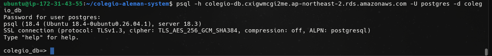


Ahora para una mejor administración nos conectamos al RDS desde pgAdmin 4, para esto registramos un nuevo servidor con los datos correspondientes, y en SSH Tunnel debemos ingresar el host (ip pública de nuestra EC2) y su clave de acceso:

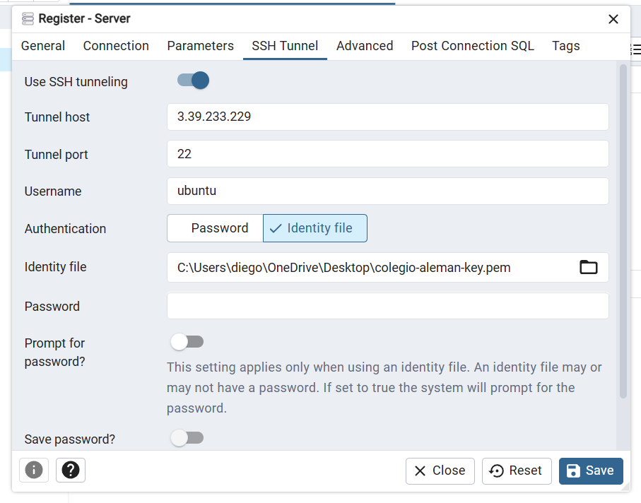

## 7. Arquitectura de Alta Disponibilidad y Escalamiento Automático (AWS Auto Scaling + ALB)

Para garantizar que el sistema de calificaciones del Colegio Alemán soporte múltiples solcitudes en temporadas de alta demanda y sin caídas de servicio, se procedió a implementar un balanceador de carga e implementando políticas de elasticidad dinámica.

### 7.1. Configuración del Balanceador de Carga de Aplicaciones (ALB)

Se creó un Application Load Balancer (ALB) denominado aleman-alb, distribuido a través de las 4 zonas de disponibilidad de la región ap-northeast-2a, 2b, 2c, 2d.

Dicho balanceador recibe las peticiones por los puertos estándares HTTP/HTTPS y las distribuye equitativamente hacia un grupo de destino denominado tg-laravel-colegio.

Se configuraron comprobaciones de estado automáticas con un período de gracia de 300 segundos, con esto si una instancia clonada deja de responder, el balanceador la apaga inmediatamente para evitar caídas en la experiencia del usuario.

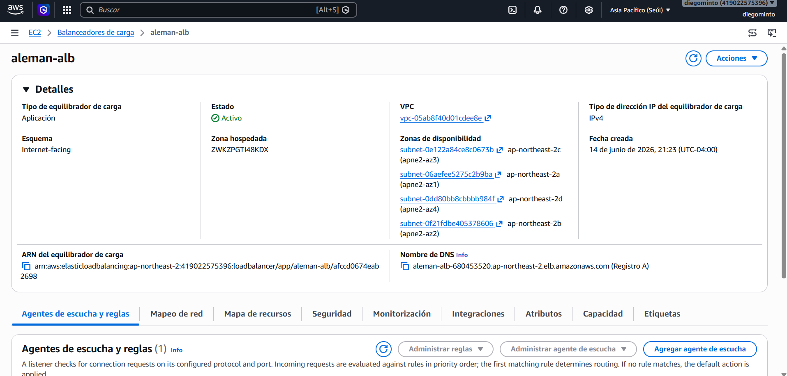

### 7.2. Configuración del Grupo de Auto Scaling (ASG)

A partir de una imagen AMI creada con la configuración base de Docker y Laravel, seguido a esto se desplegó el grupo de autoescalamiento asg-laravel-colegio:

Se configuró la capacidad mínima de 1 instancia y la máxima de 2 con el fin de ahorrar costos altos en el entorno de pruebas, considerando un entorno real se puede optar por más instancias.

Se estableció una regla basada en la métrica de Utilización Promedio de la CPU de la instancia EC2, si el consumo supera el 70%, el grupo escala automáticamente generando una nueva instancia EC2, al reducirse el tráfico, se ejecuta un scale-in para destruir las instancias redundantes y optimizar costos.

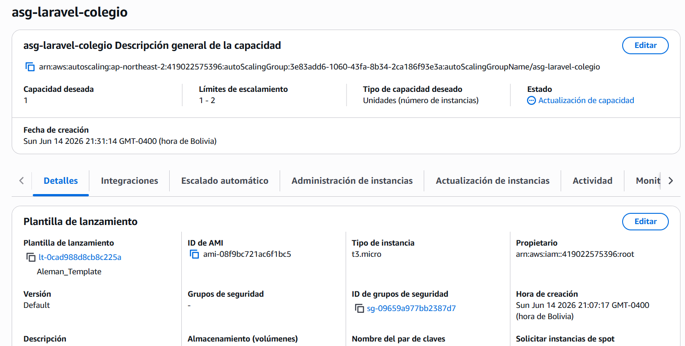

## 8. Enrutamiento y Capa de Dominio Dinámico (DuckDNS)

Dado que las direcciones IP de las instancias creadas por el Auto Scaling cambian constantemente, no es viable apuntar el dominio directamente a una instancia EC2, el balanceador de carga soluciona esto ya que entrega un DNS fijo dado por AWS.

Dadas las limitaciones de DuckCNS, se tuvo que utilizar la ip de la instancia principal, con otros proveedores de DNS más elásticos, se debe configurar el registro principal para que resuelva directamente hacia el endpoint del balanceador aleman-alb-680453520.ap-northeast-2.elb.amazonaws.com. Con esto todas las peticiones entrantes a colegioaleman-usfx.duckdns.org, serían procesadas por la infraestructura elástica de AWS configurada.

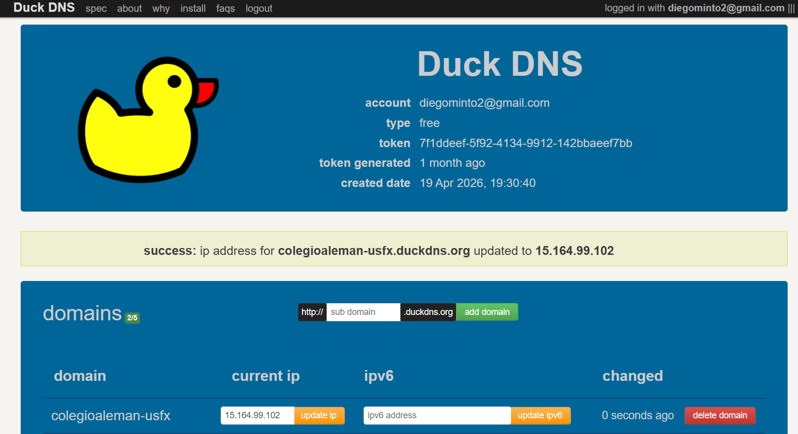

## 9. Almacenamiento de Archivos y Distribución de Contenido (Amazon S3 + Amazon CloudFront)

Ya que el sistema requería permitir a los administradores publicar noticias escolares con imágenes o archivos PDF adjuntos, se indentificó la necesidad de tener cada archivo en una fuente común de almacenamiento dado que el almacenamiento local de archivos considerando el autoescalado de instancias, puede incurrir en errores y costos altos.

### 9.1. Configuración de Amazon S3

Se creó un bucket denominado colegio-aleman-bucket-aws en la región us-east-1, destinado exclusivamente al almacenamiento de los archivos adjuntos de las noticias.

Para conectar Laravel con el bucket, se configuraron las siguientes variables de entorno:

FILESYSTEM_DISK=s3
AWS_ACCESS_KEY_ID=
AWS_SECRET_ACCESS_KEY=
AWS_DEFAULT_REGION=us-east-1
AWS_BUCKET=colegio-aleman-bucket-aws
AWS_URL=//d3cihcc5kg0b74.cloudfront.net

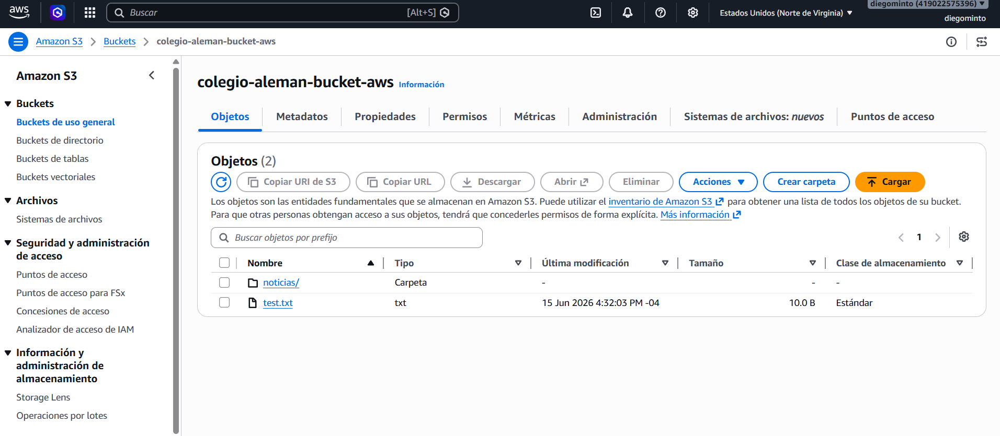

### 9.2. Configuración de Amazon CloudFront

Una vez operativo el almacenamiento en S3, se incorporó Amazon CloudFront como CDN para la entrega del contenido estático y los archivos del bucket, con el objetivo de reducir la latencia de carga para los usuarios finales.

Se creó la distribución colegio-aleman-cloudfront con la siguiente configuración:

Origen: colegio-aleman-bucket-aws.s3.us-east-1.amazonaws.com
Viewer Protocol Policy: Redirect HTTP to HTTPS.
Dominio asignado: d3cihcc5kg0b74.cloudfront.net

Posteriormente debemos verificar tener la siguiente política en el bucket S3:

```bash
{
    "Version": "2012-10-17",
    "Statement": [
        {
            "Sid": "AllowCloudFrontServicePrincipal",
            "Effect": "Allow",
            "Principal": {
                "Service": "cloudfront.amazonaws.com"
            },
            "Action": "s3:GetObject",
            "Resource": "arn:aws:s3:::colegio-aleman-bucket-aws/*",
            "Condition": {
                "ArnLike": {
                    "AWS:SourceArn": "arn:aws:cloudfront::419022575396:distribution/E1JRAUOCR9APRV"
                }
            }
        }
    ]
}
```

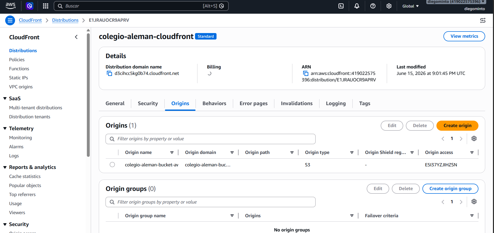

Gracias a este implementación contamos con las siguientes ventajas:

- Latencia reducida: los archivos se sirven desde el punto de AWS más cercano al usuario final, en lugar de viajar siempre desde la región us-east-1.
- Reducción de costos: el tráfico servido desde la caché de CloudFront tiene un costo de salida menor que la transferencia directa desde S3.
- Seguridad: mediante Origin Access Control, el bucket S3 no necesita exponerse públicamente y únicamente la distribución de CloudFront lee sus objetos.
- Alivio de carga sobre el origen: las solicitudes repetidas de un mismo archivo como una noticia para todo el colegio, se resuelven desde la caché de CloudFront sin generar una nueva petición a S3 cada vez.
